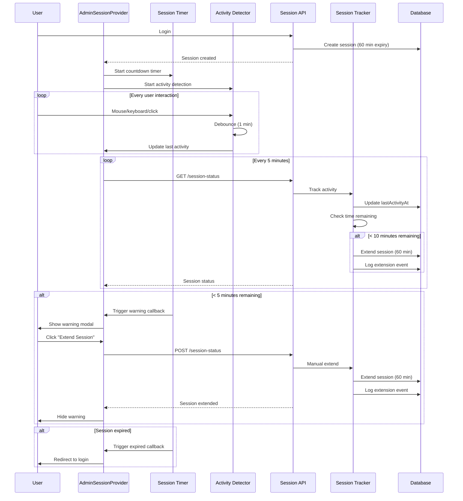

# Admin Session Timeout Feature

**Last Updated:** October 3, 2025

## Table of Contents

- [Overview](#overview)
- [Technical Architecture](#technical-architecture)
- [Configuration](#configuration)
- [Session Lifecycle](#session-lifecycle)
- [User Experience](#user-experience)
- [API Reference](#api-reference)
- [Frontend Integration](#frontend-integration)
- [Security Considerations](#security-considerations)
- [Troubleshooting](#troubleshooting)
- [Migration Guide](#migration-guide)
- [Testing](#testing)
- [Future Enhancements](#future-enhancements)

---

## Overview

### Feature Description

The Admin Session Timeout feature provides enhanced session management for admin users with automatic session extension, activity tracking, and proactive warning notifications. The system ensures secure, uninterrupted admin workflows while maintaining strict security standards.

### Key Features

- **60-minute session duration** (extended from 15 minutes)
- **Automatic session extension** when activity is detected and less than 10 minutes remain
- **Real-time activity tracking** across mouse, keyboard, click, scroll, and touch interactions
- **Visual warning system** with countdown timer at 5-minute threshold
- **One-click session extension** for immediate session renewal
- **Graceful session expiry handling** with automatic redirect to login
- **Comprehensive audit logging** for all session events
- **Multi-device session management** with ability to revoke other sessions

### Benefits for Admin Users

1. **Reduced Interruptions**: 60-minute sessions minimize disruptive logouts during active work
2. **Proactive Notifications**: 5-minute warnings give ample time to save work or extend session
3. **Seamless Experience**: Automatic extension prevents logout during active use
4. **Security Compliance**: Inactivity detection ensures abandoned sessions expire appropriately
5. **Session Visibility**: Real-time countdown and status indicators keep users informed
6. **Audit Trail**: Complete logging of session events for security and compliance

### Key Improvements Over Previous Implementation

| Aspect | Previous | Current |
|--------|----------|---------|
| Session Duration | 15 minutes | 60 minutes |
| Auto-Extension | No | Yes (when < 10 min remaining) |
| Activity Detection | Basic | Comprehensive (mouse, keyboard, clicks, scroll, touch) |
| Warning System | None | Visual modal with countdown timer |
| Warning Threshold | N/A | 5 minutes before expiry |
| Activity Tracking | Manual | Automatic with debouncing |
| Session Status | Not visible | Real-time status indicators |
| Audit Logging | Limited | Comprehensive (all session events) |
| Session Management | Single session | Multi-session with revocation |

---

## Technical Architecture

### System Components

```
┌─────────────────────────────────────────────────────────────────┐
│                        Admin Dashboard UI                        │
│  ┌──────────────────────────────────────────────────────────┐  │
│  │         AdminSessionProvider (Context)                   │  │
│  │  ┌────────────────┐  ┌──────────────────────────────┐  │  │
│  │  │ Activity       │  │ Session Timer               │  │  │
│  │  │ Detector Hook  │  │ Hook                        │  │  │
│  │  └────────────────┘  └──────────────────────────────┘  │  │
│  └──────────────────────────────────────────────────────────┘  │
│                              │                                  │
│  ┌──────────────────────────┴───────────────────────────────┐  │
│  │  SessionTimeoutWarning Modal                             │  │
│  │  - Visual countdown timer                                │  │
│  │  - Extend/Logout buttons                                 │  │
│  │  - Critical status alerts                                │  │
│  └──────────────────────────────────────────────────────────┘  │
└─────────────────────────────────────────────────────────────────┘
                              │
                              ▼
┌─────────────────────────────────────────────────────────────────┐
│                    Token Manager Utility                         │
│  - Session status checking                                      │
│  - Session extension                                            │
│  - Token refresh                                                │
│  - Time calculations                                            │
└─────────────────────────────────────────────────────────────────┘
                              │
                              ▼
┌─────────────────────────────────────────────────────────────────┐
│                       API Layer                                  │
│  ┌──────────────────────────────────────────────────────────┐  │
│  │  GET  /api/admin/auth/session-status                     │  │
│  │  POST /api/admin/auth/session-status (extend)            │  │
│  │  POST /api/admin/auth/refresh                            │  │
│  │  POST /api/admin/auth/login                              │  │
│  │  DELETE /api/admin/auth/session-status (revoke)          │  │
│  └──────────────────────────────────────────────────────────┘  │
└─────────────────────────────────────────────────────────────────┘
                              │
                              ▼
┌─────────────────────────────────────────────────────────────────┐
│                  Session Activity Tracker                        │
│  - Automatic session extension logic                            │
│  - Activity monitoring                                          │
│  - Warning threshold detection                                  │
│  - Audit logging integration                                    │
└─────────────────────────────────────────────────────────────────┘
                              │
                              ▼
┌─────────────────────────────────────────────────────────────────┐
│                    Database Layer                                │
│  ┌──────────────────────────────────────────────────────────┐  │
│  │  AdminSession Model (Drizzle ORM)                        │  │
│  │  - Session CRUD operations                               │  │
│  │  - Token validation                                      │  │
│  │  - Inactivity detection                                  │  │
│  │  - Session extension                                     │  │
│  │  - Expiry cleanup                                        │  │
│  └──────────────────────────────────────────────────────────┘  │
│  ┌──────────────────────────────────────────────────────────┐  │
│  │  AuditLog Model                                          │  │
│  │  - Session event logging                                 │  │
│  │  - Security audit trail                                  │  │
│  └──────────────────────────────────────────────────────────┘  │
└─────────────────────────────────────────────────────────────────┘
                              │
                              ▼
┌─────────────────────────────────────────────────────────────────┐
│                      PostgreSQL Database                         │
│  - admin_sessions table                                         │
│  - audit_logs table                                             │
└─────────────────────────────────────────────────────────────────┘
```

### Data Flow



---

## Configuration

### Environment Variables

The following environment variables control session timeout behavior:

| Variable | Description | Default | Recommendation |
|----------|-------------|---------|----------------|
| `JWT_ACCESS_SECRET` | Secret key for signing access tokens | `default-access-secret` | **Required**: Set unique secret |
| `JWT_REFRESH_SECRET` | Secret key for signing refresh tokens | `default-refresh-secret` | **Required**: Set unique secret |
| `JWT_ACCESS_EXPIRY` | Access token expiry duration | `60m` | `60m` (60 minutes) |
| `JWT_REFRESH_EXPIRY` | Refresh token expiry duration | `7d` | `7d` (7 days) |
| `ADMIN_SESSION_TIMEOUT` | Session timeout in seconds | `3600` | `3600` (60 minutes) |
| `ADMIN_SESSION_WARNING_THRESHOLD` | Warning threshold in seconds | `300` | `300` (5 minutes) |
| `ADMIN_ACTIVITY_CHECK_INTERVAL` | Activity check interval in seconds | `300` | `300` (5 minutes) |
| `ADMIN_MAX_INACTIVE_TIME` | Maximum inactive time in seconds | `1800` | `1800` (30 minutes) |

### Example `.env` Configuration

```bash
# JWT Secrets (REQUIRED - Generate unique secrets for production)
JWT_ACCESS_SECRET=your-secure-access-secret-here
JWT_REFRESH_SECRET=your-secure-refresh-secret-here

# Token Expiry Configuration
JWT_ACCESS_EXPIRY=60m        # 60 minutes
JWT_REFRESH_EXPIRY=7d        # 7 days

# Session Timeout Configuration
ADMIN_SESSION_TIMEOUT=3600            # 60 minutes in seconds
ADMIN_SESSION_WARNING_THRESHOLD=300   # 5 minutes in seconds
ADMIN_ACTIVITY_CHECK_INTERVAL=300     # Check every 5 minutes
ADMIN_MAX_INACTIVE_TIME=1800          # 30 minutes max inactivity
```

### Customization Examples

#### Shorter Session Timeout (30 minutes)

```bash
JWT_ACCESS_EXPIRY=30m
ADMIN_SESSION_TIMEOUT=1800            # 30 minutes
ADMIN_SESSION_WARNING_THRESHOLD=300   # 5 minutes warning
ADMIN_MAX_INACTIVE_TIME=900           # 15 minutes max inactivity
```

#### Longer Session Timeout (2 hours)

```bash
JWT_ACCESS_EXPIRY=120m
ADMIN_SESSION_TIMEOUT=7200            # 120 minutes
ADMIN_SESSION_WARNING_THRESHOLD=600   # 10 minutes warning
ADMIN_MAX_INACTIVE_TIME=3600          # 60 minutes max inactivity
```

#### More Frequent Activity Checks (every 2 minutes)

```bash
ADMIN_ACTIVITY_CHECK_INTERVAL=120     # Check every 2 minutes
```

### Security Best Practices

1. **Always use unique, cryptographically secure secrets** for `JWT_ACCESS_SECRET` and `JWT_REFRESH_SECRET`
2. **Never commit secrets** to version control
3. **Rotate secrets periodically** (recommended: every 90 days)
4. **Use different secrets** for development, staging, and production environments
5. **Keep warning threshold** at least 5 minutes to give users adequate time to respond
6. **Set max inactive time** lower than session timeout for automatic extension

---

## Session Lifecycle

### 1. Session Creation (Login)

**Trigger:** User successfully authenticates via `/api/admin/auth/login`

**Process:**
1. Validate user credentials
2. Generate access token (60-minute expiry) and refresh token (7-day expiry)
3. Create `AdminSession` record in database with:
   - `accessToken` and `refreshToken`
   - `tokenHash` (SHA-256 hash of access token)
   - `expiresAt` (current time + 60 minutes)
   - `lastActivityAt` (current time)
   - `status` = 'active'
4. Log login event in `AuditLog`
5. Return tokens to client

**Files Involved:**
- `/src/app/api/admin/auth/login/route.ts`
- `/src/lib/auth/jwt.ts`
- `/src/lib/db/models/AdminSession.ts`
- `/src/lib/db/models/AuditLog.ts`

---

### 2. Session Maintenance (Activity Tracking)

**Trigger:** User interacts with the UI (mouse, keyboard, clicks, scroll, touch)

**Process:**
1. `useActivityDetector` hook detects user activity
2. Activity is debounced (1-minute intervals to prevent excessive API calls)
3. On activity detection:
   - Update `lastActivityAt` in `AdminSession`
   - Check time remaining until expiry
   - If < 10 minutes remaining AND user is active (< 30 min since last activity):
     - Automatically extend session by 60 minutes
     - Log auto-extension event
4. Periodic polling (every 5 minutes):
   - `AdminSessionProvider` calls `GET /api/admin/auth/session-status`
   - Backend updates `lastActivityAt`
   - Returns current session status and time remaining

**Files Involved:**
- `/src/hooks/useActivityDetector.ts`
- `/src/components/admin/providers/AdminSessionProvider.tsx`
- `/src/app/api/admin/auth/session-status/route.ts` (GET)
- `/src/lib/auth/session-tracker.ts`

---

### 3. Session Extension

#### Automatic Extension

**Trigger:** User activity detected with < 10 minutes remaining

**Process:**
1. `trackSessionActivity()` checks if session has < 10 minutes remaining
2. Checks if user is active (< 30 minutes since last activity)
3. If both conditions met:
   - Extend `expiresAt` by 60 minutes
   - Update `lastActivityAt`
   - Log auto-extension in `AuditLog`
4. Return updated session status to frontend

**Files Involved:**
- `/src/lib/auth/session-tracker.ts` (lines 46-88)

#### Manual Extension

**Trigger:** User clicks "Extend Session" button in warning modal

**Process:**
1. User clicks "Extend Session" in `SessionTimeoutWarning` modal
2. Frontend calls `POST /api/admin/auth/session-status`
3. Backend validates session
4. Extends `expiresAt` by 60 minutes (customizable via request body)
5. Updates `lastActivityAt`
6. Logs manual extension in `AuditLog`
7. Returns updated session status
8. Frontend updates timer and hides warning

**Files Involved:**
- `/src/components/admin/session/SessionTimeoutWarning.tsx`
- `/src/app/api/admin/auth/session-status/route.ts` (POST)
- `/src/lib/auth/session-tracker.ts` (`manualExtendSession()`)

---

### 4. Session Warning (5-minute threshold)

**Trigger:** Session time remaining drops below 5 minutes

**Process:**
1. `useSessionTimer` hook monitors time remaining every second
2. When `timeRemaining <= 300 seconds`:
   - Set `isWarning = true`
   - Trigger `onWarning()` callback
3. `AdminSessionProvider` sets `showWarning = true`
4. `SessionTimeoutWarning` modal displays:
   - Countdown timer (MM:SS format)
   - Progress bar showing time remaining
   - "Extend Session" button (primary, auto-focused)
   - "Logout" button (secondary)
5. If time drops below 60 seconds:
   - Status changes to `critical`
   - Red color scheme
   - Additional critical warning message
6. Modal cannot be dismissed by clicking outside or pressing Escape (forces user decision)

**Visual States:**
- **Warning (5-1 min):** Yellow/amber icon, "Session Expiring Soon"
- **Critical (< 1 min):** Red icon, "Critical: Your session is about to expire"

**Files Involved:**
- `/src/hooks/useSessionTimer.ts`
- `/src/components/admin/session/SessionTimeoutWarning.tsx`
- `/src/components/admin/providers/AdminSessionProvider.tsx`

---

### 5. Session Expiry (60-minute timeout)

**Trigger:** Session time remaining reaches 0 seconds

**Process:**
1. `useSessionTimer` detects `timeRemaining <= 0`
2. Triggers `onExpired()` callback
3. `AdminSessionProvider` handles expiry:
   - Clears tokens from localStorage
   - Sets `sessionStatus = null`
   - Redirects to `/admin/login?expired=true`
4. Login page displays "Your session has expired" message
5. Backend cleanup (via cron job):
   - Marks expired sessions as `status = 'expired'`
   - Deletes expired sessions (scheduled cleanup)
   - Logs cleanup events

**Files Involved:**
- `/src/hooks/useSessionTimer.ts`
- `/src/components/admin/providers/AdminSessionProvider.tsx`
- `/src/lib/auth/tokenManager.ts`
- `/src/app/api/admin/cron/cleanup-sessions/route.ts`

---

### 6. Session Cleanup (Cron Job)

**Trigger:** Scheduled cron job (recommended: every 1 hour)

**Process:**
1. Call `POST /api/admin/cron/cleanup-sessions`
2. `cleanupExpiredSessions()` runs:
   - Query sessions where `expiresAt <= now` AND `status = 'active'`
   - Delete expired sessions
   - Log cleanup event with count of deleted sessions
3. Return count of deleted sessions

**Cron Configuration (Vercel):**
```json
{
  "crons": [
    {
      "path": "/api/admin/cron/cleanup-sessions",
      "schedule": "0 * * * *"
    }
  ]
}
```

**Files Involved:**
- `/src/app/api/admin/cron/cleanup-sessions/route.ts`
- `/src/lib/auth/session-tracker.ts` (`cleanupExpiredSessions()`)
- `/src/lib/db/models/AdminSession.ts` (`deleteExpired()`)

---

## User Experience

### What Users See and Experience

#### 1. Active Session (60-10 minutes remaining)

**Visual Indicators:**
- No visible warnings
- Optional status indicator in header/sidebar (if implemented):
  - Green dot: "Session Active"
  - Hover tooltip: "Session expires in XX minutes"

**User Experience:**
- Seamless, uninterrupted work
- No action required
- Session automatically extends if user is active

---

#### 2. Warning State (5-1 minutes remaining)

**Visual Indicators:**
- Warning modal appears (cannot be dismissed)
- Yellow/amber alert icon
- Title: "Session Expiring Soon"
- Countdown timer (e.g., "4:23")
- Progress bar showing time remaining
- Two action buttons:
  - **"Extend Session"** (primary, auto-focused, blue)
  - **"Logout"** (secondary, gray)

**User Experience:**
- Modal appears over current work
- Clear countdown shows exactly how much time remains
- One-click extension renews session for another 60 minutes
- Focus automatically on "Extend Session" button for quick action
- If user continues working without clicking, session may auto-extend (if < 10 min threshold crossed)

**Example Message:**
> Your session will expire in **4:23**.
> Click "Extend Session" to continue working, or "Logout" to end your session now.

---

#### 3. Critical State (< 1 minute remaining)

**Visual Indicators:**
- Same modal, but with critical styling:
  - Red alert icon (XCircle)
  - Red title color
  - Red "Extend Session" button
  - Additional red alert box at bottom:
    > **Critical:** Your session is about to expire. Please save your work immediately.

**User Experience:**
- High urgency visual cues
- User should immediately save work or extend session
- Very limited time to respond

---

#### 4. Session Expired (0 seconds)

**Visual Indicators:**
- Automatic redirect to `/admin/login?expired=true`
- Login page shows error message:
  > Your session has expired. Please login again.

**User Experience:**
- Unsaved work may be lost
- User must re-authenticate
- Previous session is terminated

---

### How to Extend Session

#### Method 1: Automatic Extension (Recommended)

**No user action required**. If you're actively using the admin dashboard:
1. System detects your activity (mouse, keyboard, clicks)
2. When session has < 10 minutes remaining
3. AND you've been active in the last 30 minutes
4. Session automatically extends by 60 minutes
5. You continue working without interruption

#### Method 2: Manual Extension

When warning modal appears:
1. Click the **"Extend Session"** button (or press Enter, as it's auto-focused)
2. Session immediately extends by 60 minutes
3. Warning modal disappears
4. Countdown timer resets to 60:00
5. Continue working normally

**Tip:** You can extend multiple times. Each extension adds another 60 minutes.

---

### What Happens on Expiry

If session expires (user didn't extend and wasn't active):
1. **Automatic redirect** to login page with message: "Your session has expired"
2. **All tokens cleared** from browser storage
3. **Session marked as expired** in database
4. **Audit log created** for session termination
5. **User must re-authenticate** to continue

**To prevent expiry:**
- Stay active (move mouse, type, click within dashboard)
- Respond to warning modal when it appears
- Enable auto-extension by remaining active

---

## API Reference

### Session Status Endpoints

#### `GET /api/admin/auth/session-status`

**Description:** Get current session status and time remaining.

**Authentication:** Required (Bearer token)

**Request:**
```http
GET /api/admin/auth/session-status HTTP/1.1
Authorization: Bearer <access_token>
```

**Response (200 OK):**
```json
{
  "success": true,
  "session": {
    "id": "session_uuid",
    "status": "active",
    "expiresAt": "2025-10-03T23:45:00.000Z",
    "lastActivityAt": "2025-10-03T22:50:00.000Z",
    "createdAt": "2025-10-03T21:45:00.000Z"
  },
  "timing": {
    "minutesRemaining": 55,
    "secondsRemaining": 3300,
    "minutesSinceActivity": 5,
    "shouldWarn": false,
    "shouldExtend": false
  },
  "user": {
    "id": "user_uuid",
    "email": "admin@example.com",
    "role": "super_admin"
  }
}
```

**Response (401 Unauthorized):**
```json
{
  "error": "Not authenticated"
}
```

**Response (404 Not Found):**
```json
{
  "error": "Session not found"
}
```

---

#### `POST /api/admin/auth/session-status`

**Description:** Manually extend the current session.

**Authentication:** Required (Bearer token)

**Request:**
```http
POST /api/admin/auth/session-status HTTP/1.1
Authorization: Bearer <access_token>
Content-Type: application/json

{
  "extendMinutes": 60  // Optional, default: 60, max: 120
}
```

**Response (200 OK):**
```json
{
  "success": true,
  "message": "Session extended by 60 minutes",
  "session": {
    "id": "session_uuid",
    "expiresAt": "2025-10-04T00:45:00.000Z",
    "lastActivityAt": "2025-10-03T23:45:00.000Z"
  },
  "extendedMinutes": 60
}
```

**Response (400 Bad Request):**
```json
{
  "error": "Extension duration must be between 1 and 120 minutes"
}
```

**Response (500 Internal Server Error):**
```json
{
  "error": "Failed to extend session"
}
```

---

#### `DELETE /api/admin/auth/session-status`

**Description:** Revoke all other sessions for the current user (security feature).

**Authentication:** Required (Bearer token)

**Request:**
```http
DELETE /api/admin/auth/session-status HTTP/1.1
Authorization: Bearer <access_token>
```

**Response (200 OK):**
```json
{
  "success": true,
  "message": "Revoked 2 other session(s)",
  "deletedCount": 2
}
```

**Use Case:** If user suspects unauthorized access or wants to force logout from all other devices.

---

### Authentication Endpoints

#### `POST /api/admin/auth/login`

**Description:** Authenticate admin user and create session.

**Authentication:** None (public endpoint)

**Request:**
```http
POST /api/admin/auth/login HTTP/1.1
Content-Type: application/json

{
  "email": "admin@example.com",
  "password": "securePassword123"
}
```

**Response (200 OK):**
```json
{
  "success": true,
  "user": {
    "id": "user_uuid",
    "email": "admin@example.com",
    "role": "super_admin",
    "permissions": ["view_analytics", "manage_users", ...]
  },
  "session": {
    "accessToken": "eyJhbGc...",
    "refreshToken": "eyJhbGc...",
    "expiresIn": 3600,
    "refreshExpiresIn": 604800
  }
}
```

**Response (401 Unauthorized):**
```json
{
  "error": "Invalid credentials"
}
```

---

#### `POST /api/admin/auth/refresh`

**Description:** Refresh access token using refresh token.

**Authentication:** Required (Refresh token in cookie or body)

**Request:**
```http
POST /api/admin/auth/refresh HTTP/1.1
Content-Type: application/json
Cookie: refreshToken=eyJhbGc...

// Or with body:
{
  "refreshToken": "eyJhbGc..."
}
```

**Response (200 OK):**
```json
{
  "success": true,
  "accessToken": "eyJhbGc...",
  "refreshToken": "eyJhbGc...",
  "expiresIn": 3600
}
```

**Response (401 Unauthorized):**
```json
{
  "error": "Invalid or expired refresh token"
}
```

---

#### `POST /api/admin/auth/logout`

**Description:** Logout and terminate session.

**Authentication:** Required (Bearer token)

**Request:**
```http
POST /api/admin/auth/logout HTTP/1.1
Authorization: Bearer <access_token>
```

**Response (200 OK):**
```json
{
  "success": true,
  "message": "Logged out successfully"
}
```

---

### Cron/Maintenance Endpoints

#### `POST /api/admin/cron/cleanup-sessions`

**Description:** Clean up expired sessions (for scheduled jobs).

**Authentication:** Optional (Cron secret recommended)

**Request:**
```http
POST /api/admin/cron/cleanup-sessions HTTP/1.1
Authorization: Bearer <cron_secret>
```

**Response (200 OK):**
```json
{
  "success": true,
  "deletedCount": 15,
  "message": "Cleaned up 15 expired sessions"
}
```

**Recommended Schedule:** Every 1 hour (`0 * * * *`)

---

## Frontend Integration

### Using AdminSessionProvider

Wrap your admin layout with `AdminSessionProvider` to enable session management:

```tsx
// /src/app/admin/layout.tsx
import { AdminSessionProvider } from '@/components/admin/providers/AdminSessionProvider';

export default function AdminLayout({ children }: { children: React.ReactNode }) {
  return (
    <AdminSessionProvider
      pollInterval={300000}        // 5 minutes (default)
      autoRefreshThreshold={10}    // 10 minutes (default)
      warningThreshold={5}         // 5 minutes (default)
    >
      {children}
    </AdminSessionProvider>
  );
}
```

**Provider Props:**

| Prop | Type | Default | Description |
|------|------|---------|-------------|
| `pollInterval` | `number` | `300000` | How often to check session status (ms) |
| `autoRefreshThreshold` | `number` | `10` | Auto-refresh when less than X minutes remain |
| `warningThreshold` | `number` | `5` | Show warning when less than X minutes remain |

---

### Available Hooks

#### `useAdminSession()`

Access session state and methods from any component within `AdminSessionProvider`:

```tsx
import { useAdminSession } from '@/components/admin/providers/AdminSessionProvider';

function MyComponent() {
  const {
    sessionStatus,        // Current session status from backend
    isAuthenticated,      // Whether session is valid
    isLoading,            // Whether session is loading
    lastActivityTime,     // Last activity time
    timeRemaining,        // Time remaining in seconds
    formattedTime,        // Formatted time string (MM:SS)
    showWarning,          // Whether warning should be shown
    status,               // 'active' | 'warning' | 'critical' | 'expired'
    handleExtendSession,  // Function to manually extend session
    refreshSession,       // Function to refresh session status
    logout,               // Function to logout
  } = useAdminSession();

  return (
    <div>
      <p>Session expires in: {formattedTime}</p>
      {status === 'warning' && <button onClick={handleExtendSession}>Extend</button>}
    </div>
  );
}
```

---

#### `useActivityDetector()`

Detect user activity with customizable debouncing:

```tsx
import { useActivityDetector } from '@/hooks/useActivityDetector';

function MyComponent() {
  const {
    lastActivityTime,          // Last activity timestamp
    getSecondsSinceLastActivity, // Function to get seconds since last activity
    isIdle,                    // Function to check if user is idle
    triggerActivity,           // Manually trigger activity
  } = useActivityDetector({
    debounceTime: 60000,       // Debounce to 1 minute (default)
    events: ['mousemove', 'keydown', 'click', 'scroll', 'touchstart'],
    enabled: true,             // Enable/disable detector
    onActivity: () => {        // Callback on activity
      console.log('User is active!');
    },
  });

  const secondsSinceActivity = getSecondsSinceLastActivity();
  const userIsIdle = isIdle(300); // Check if idle for 5 minutes

  return (
    <div>
      <p>Last activity: {lastActivityTime.toLocaleTimeString()}</p>
      <p>Seconds since activity: {secondsSinceActivity}</p>
      <p>User idle: {userIsIdle ? 'Yes' : 'No'}</p>
    </div>
  );
}
```

---

#### `useSessionTimer()`

Real-time session countdown timer with threshold callbacks:

```tsx
import { useSessionTimer } from '@/hooks/useSessionTimer';

function MyComponent() {
  const {
    timeRemaining,        // Time remaining in seconds
    formattedTime,        // Formatted time (MM:SS)
    isWarning,            // Whether in warning state
    isCritical,           // Whether in critical state
    isExpired,            // Whether expired
    status,               // 'active' | 'warning' | 'critical' | 'expired'
    percentageRemaining,  // Percentage of time remaining (0-100)
  } = useSessionTimer({
    updateInterval: 1000,       // Update every second (default)
    updateThreshold: 600,       // Only update when < 10 min remaining
    warningThreshold: 300,      // Warning at 5 minutes (default)
    criticalThreshold: 60,      // Critical at 1 minute (default)
    enabled: true,              // Enable/disable timer
    onWarning: () => {          // Callback when warning threshold reached
      console.log('Session expiring soon!');
    },
    onCritical: () => {         // Callback when critical threshold reached
      console.log('Session about to expire!');
    },
    onExpired: () => {          // Callback when session expires
      console.log('Session expired!');
    },
  });

  return (
    <div>
      <p>Status: {status}</p>
      <p>Time: {formattedTime}</p>
      <progress value={percentageRemaining} max={100} />
    </div>
  );
}
```

---

### Component Integration Examples

#### Custom Session Status Indicator

```tsx
'use client';

import { useAdminSession } from '@/components/admin/providers/AdminSessionProvider';
import { Clock } from 'lucide-react';

export function SessionStatusIndicator() {
  const { status, formattedTime, isAuthenticated } = useAdminSession();

  if (!isAuthenticated) return null;

  const statusColors = {
    active: 'text-green-500',
    warning: 'text-yellow-500',
    critical: 'text-red-500',
    expired: 'text-gray-500',
  };

  return (
    <div className="flex items-center gap-2">
      <Clock className={`size-4 ${statusColors[status]}`} />
      <span className="text-sm">{formattedTime}</span>
    </div>
  );
}
```

#### Manual Extend Button

```tsx
'use client';

import { useAdminSession } from '@/components/admin/providers/AdminSessionProvider';
import { Button } from '@/components/ui/button';

export function ExtendSessionButton() {
  const { handleExtendSession, timeRemaining } = useAdminSession();
  const [isExtending, setIsExtending] = useState(false);

  const handleClick = async () => {
    setIsExtending(true);
    await handleExtendSession();
    setIsExtending(false);
  };

  // Only show if less than 30 minutes remaining
  if (timeRemaining > 1800) return null;

  return (
    <Button onClick={handleClick} disabled={isExtending}>
      {isExtending ? 'Extending...' : 'Extend Session'}
    </Button>
  );
}
```

---

### Activity Detection Configuration

Default events tracked:
- `mousemove` - Mouse movement
- `keydown` - Keyboard input
- `click` - Mouse clicks
- `scroll` - Page scrolling
- `touchstart` - Touch interactions (mobile)

**Custom event configuration:**

```tsx
<AdminSessionProvider>
  <ActivityDetectorWrapper
    events={['click', 'keydown']}  // Only track clicks and keyboard
    debounceTime={120000}          // 2-minute debounce
  />
</AdminSessionProvider>
```

---

## Security Considerations

### Token Storage and Handling

1. **Access Tokens:**
   - Stored in `localStorage` as `admin_token`
   - Short-lived (60 minutes)
   - Sent in `Authorization: Bearer <token>` header
   - Never logged or exposed in URLs

2. **Refresh Tokens:**
   - Stored in `localStorage` as `admin_refresh_token`
   - Long-lived (7 days)
   - Used only for token refresh endpoint
   - Single-use (rotated on each refresh)

3. **Token Hashing:**
   - Access tokens are hashed (SHA-256) before database storage
   - Original tokens never stored in database
   - Hash used for session lookup and validation

**Security Best Practices:**
- Tokens cleared on logout and session expiry
- Tokens validated on every API request
- Expired tokens automatically rejected
- Token rotation on refresh prevents replay attacks

---

### Inactivity Detection

**How It Works:**
1. Track `lastActivityAt` timestamp on every API request
2. Calculate `timeSinceActivity = now - lastActivityAt`
3. If `timeSinceActivity > MAX_INACTIVE_TIME` (30 minutes):
   - Do NOT auto-extend session
   - Let session expire naturally
   - Force user re-authentication

**Why It Matters:**
- Prevents session extension for abandoned browsers
- Ensures unattended sessions expire even if tab is open
- Balances convenience with security

**Configuration:**
```bash
ADMIN_MAX_INACTIVE_TIME=1800  # 30 minutes (default)
```

---

### Session Hijacking Prevention

**Measures Implemented:**

1. **Token Hashing:**
   - Tokens hashed before storage
   - Original tokens never in database
   - Prevents token theft from database breaches

2. **Token Rotation:**
   - Refresh tokens rotated on use
   - Old refresh tokens invalidated
   - Prevents token replay attacks

3. **Session Binding:**
   - Sessions tied to specific user ID
   - User email and role included in token payload
   - Mismatch triggers session invalidation

4. **Multi-Session Management:**
   - Users can revoke all other sessions
   - `DELETE /api/admin/auth/session-status` endpoint
   - Useful if device is compromised

5. **Audit Logging:**
   - All session events logged (creation, extension, revocation)
   - Includes IP address, user agent, timestamp
   - Enables forensic analysis

**Additional Recommendations:**
- Implement IP address validation (optional, may break VPNs)
- Add user agent validation for desktop sessions
- Enable 2FA for admin accounts
- Monitor audit logs for suspicious patterns

---

### Audit Logging

**Events Logged:**

| Event | Action | Description |
|-------|--------|-------------|
| Session Created | `create` | User logs in, new session created |
| Session Extended (Auto) | `update` | Session auto-extended due to activity |
| Session Extended (Manual) | `update` | User manually extended session |
| Session Expired | `delete` | Session expired due to timeout |
| Session Revoked | `delete` | User or admin revoked session |
| Sessions Cleaned Up | `delete` | Cron job cleaned up expired sessions |

**Audit Log Structure:**
```typescript
{
  adminUserId: string;
  adminEmail: string;
  adminRole: string;
  action: 'create' | 'update' | 'delete';
  entityType: 'admin_session';
  entityId: string;  // Session ID
  description: string;
  metadata: {
    // Event-specific data (e.g., old/new expiry times, IP address)
  };
  isSuccess: boolean;
  createdAt: Date;
}
```

**Accessing Audit Logs:**
```typescript
// Query session-related audit logs
const logs = await AuditLog.find({
  entityType: 'admin_session',
  adminUserId: 'user_id',
  createdAt: { $gte: new Date('2025-10-01') }
});
```

---

## Troubleshooting

### Common Issues and Solutions

#### Issue: Session expires too quickly

**Symptoms:**
- Users logged out before 60 minutes
- Frequent session expiry warnings

**Possible Causes:**
1. **Incorrect environment variables:**
   ```bash
   # Check .env file
   JWT_ACCESS_EXPIRY=60m  # Should be 60m, not 15m
   ADMIN_SESSION_TIMEOUT=3600  # Should be 3600, not 900
   ```

2. **Server/client time mismatch:**
   - Verify server and client clocks are synchronized
   - Check server timezone settings

3. **Auto-extension not working:**
   - Verify `ADMIN_MAX_INACTIVE_TIME` is set correctly
   - Check activity detector is enabled
   - Review browser console for errors

**Solution:**
1. Verify environment variables in `.env`
2. Restart development server after changing `.env`
3. Check browser DevTools Network tab for session API calls
4. Review backend logs for session extension events

---

#### Issue: Warning modal not appearing

**Symptoms:**
- Session expires without warning
- No modal shown at 5-minute threshold

**Possible Causes:**
1. **AdminSessionProvider not wrapping layout:**
   ```tsx
   // Incorrect
   <Layout>{children}</Layout>

   // Correct
   <AdminSessionProvider>
     <Layout>{children}</Layout>
   </AdminSessionProvider>
   ```

2. **SessionTimeoutWarning component not included:**
   - Check if `<SessionTimeoutWarning />` is rendered in layout

3. **warningThreshold misconfigured:**
   ```tsx
   <AdminSessionProvider warningThreshold={5}>  {/* Should be 5 (minutes) */}
   ```

**Solution:**
1. Ensure `AdminSessionProvider` wraps admin layout
2. Add `<SessionTimeoutWarning />` component to layout
3. Verify `warningThreshold` prop is set correctly

---

#### Issue: Tokens not persisting across page refreshes

**Symptoms:**
- User logged out on page refresh
- Tokens cleared unexpectedly

**Possible Causes:**
1. **localStorage not accessible:**
   - Incognito/private mode may block localStorage
   - Browser settings may block localStorage

2. **Token expiry time not stored:**
   - Check `tokenManager.storeTokenExpiry()` is called
   - Verify `admin_token_expiry` key in localStorage

3. **Client-side hydration issue:**
   - Next.js hydration may clear state
   - Use `'use client'` directive in components

**Solution:**
1. Test in non-private browser window
2. Check localStorage in DevTools (Application tab)
3. Verify token expiry is stored on login
4. Add error handling for localStorage failures

---

#### Issue: Activity detection not working

**Symptoms:**
- Session not auto-extending despite user activity
- `lastActivityAt` not updating

**Possible Causes:**
1. **Activity detector disabled:**
   ```tsx
   useActivityDetector({ enabled: false })  // Should be true
   ```

2. **Debounce time too long:**
   ```tsx
   useActivityDetector({ debounceTime: 600000 })  // 10 minutes - too long
   ```

3. **Events not firing:**
   - User not interacting with tracked events
   - Event listeners not attached

**Solution:**
1. Verify `enabled: true` in activity detector
2. Reduce debounce time to 60000 (1 minute)
3. Check browser console for activity logs
4. Test with different activity types (mouse, keyboard, clicks)

---

#### Issue: Session cleanup job not running

**Symptoms:**
- Expired sessions accumulating in database
- Database table growing indefinitely

**Possible Causes:**
1. **Cron job not configured:**
   - Missing `vercel.json` configuration
   - Cron endpoint not deployed

2. **Cron endpoint errors:**
   - Check function logs for errors
   - Verify database connection

**Solution:**
1. Add cron configuration to `vercel.json`:
   ```json
   {
     "crons": [{
       "path": "/api/admin/cron/cleanup-sessions",
       "schedule": "0 * * * *"
     }]
   }
   ```
2. Test endpoint manually: `POST /api/admin/cron/cleanup-sessions`
3. Check Vercel dashboard for cron job execution logs
4. Verify database connection in cron function

---

### Debug Tips

#### Enable Verbose Logging

Add console logs to track session lifecycle:

```typescript
// /src/lib/auth/session-tracker.ts
export async function trackSessionActivity(...) {
  console.log('[Session] Tracking activity:', {
    sessionId,
    minutesRemaining,
    shouldExtend,
    shouldWarn
  });
  // ...rest of function
}
```

#### Check Session Status in Browser

Open DevTools Console:
```javascript
// Check stored tokens
console.log('Access Token:', localStorage.getItem('admin_token'));
console.log('Expiry:', localStorage.getItem('admin_token_expiry'));

// Calculate time remaining
const expiry = new Date(localStorage.getItem('admin_token_expiry'));
const now = new Date();
const remaining = Math.floor((expiry - now) / 1000 / 60);
console.log('Minutes remaining:', remaining);
```

#### Monitor API Calls

In DevTools Network tab, filter by `session-status`:
- Check request frequency (should be every 5 minutes)
- Verify response status codes (200 = success)
- Review response payload for session data

#### Test Session Expiry

Temporarily reduce session timeout for testing:
```bash
# .env.local
ADMIN_SESSION_TIMEOUT=300  # 5 minutes for testing
ADMIN_SESSION_WARNING_THRESHOLD=60  # 1 minute warning
```

---

### Log Locations

**Backend Logs:**
- Vercel: Dashboard → Project → Functions → Logs
- Local: Terminal running `npm run dev`

**Frontend Logs:**
- Browser DevTools Console
- Network tab for API requests

**Database Logs:**
- Audit logs table: `SELECT * FROM audit_logs WHERE entity_type = 'admin_session'`
- Session table: `SELECT * FROM admin_sessions WHERE status = 'active'`

---

### Support Contact

For additional support:
- **Internal Team:** Contact backend/frontend engineering team
- **Documentation:** Review files in `/docs/` directory
- **GitHub Issues:** File bug report with reproduction steps
- **Slack:** #engineering-support channel

---

## Migration Guide

### Changes from Previous Implementation

| Aspect | Previous | Current | Migration Required? |
|--------|----------|---------|---------------------|
| Session Duration | 15 minutes | 60 minutes | No - automatic |
| Auto-Extension | None | Yes (< 10 min) | No - automatic |
| Warning System | None | Yes (< 5 min) | **Yes** - Add component |
| Activity Tracking | Basic | Comprehensive | No - automatic |
| UI Components | None | Warning modal, indicators | **Yes** - Add to layout |
| Environment Variables | Minimal | Extensive | **Yes** - Update `.env` |

---

### Breaking Changes

**None** - This implementation is backward-compatible with existing sessions. Old sessions will continue to work but won't have extended timeout or auto-extension until user logs in again.

---

### Update Checklist for Existing Deployments

#### 1. Update Environment Variables

Add to `.env` or `.env.production`:
```bash
# Required
JWT_ACCESS_SECRET=your-unique-secret-here
JWT_REFRESH_SECRET=your-unique-refresh-secret-here

# Optional (defaults work for most cases)
JWT_ACCESS_EXPIRY=60m
JWT_REFRESH_EXPIRY=7d
ADMIN_SESSION_TIMEOUT=3600
ADMIN_SESSION_WARNING_THRESHOLD=300
ADMIN_ACTIVITY_CHECK_INTERVAL=300
ADMIN_MAX_INACTIVE_TIME=1800
```

**Action:** Copy and customize environment variables.

---

#### 2. Update Admin Layout

Wrap admin layout with `AdminSessionProvider`:

```tsx
// /src/app/admin/layout.tsx
import { AdminSessionProvider } from '@/components/admin/providers/AdminSessionProvider';
import { SessionTimeoutWarning } from '@/components/admin/session/SessionTimeoutWarning';

export default function AdminLayout({ children }: { children: React.ReactNode }) {
  return (
    <AdminSessionProvider>
      <div className="admin-layout">
        {/* Your existing layout */}
        {children}
      </div>
      {/* Add warning modal */}
      <SessionTimeoutWarning />
    </AdminSessionProvider>
  );
}
```

**Action:** Update layout file to include provider and warning modal.

---

#### 3. Deploy Database Migrations

If `admin_sessions` table doesn't exist, run Drizzle migration:

```bash
# Generate migration
npm run db:generate

# Apply migration
npm run db:migrate
```

**Action:** Run database migrations to create/update session table.

---

#### 4. Configure Cron Job (Production)

Add to `vercel.json`:
```json
{
  "crons": [
    {
      "path": "/api/admin/cron/cleanup-sessions",
      "schedule": "0 * * * *"
    }
  ]
}
```

**Action:** Deploy cron configuration for automatic session cleanup.

---

#### 5. Test New Implementation

**Manual Testing Checklist:**
- [ ] Login creates 60-minute session
- [ ] Activity detection updates last activity time
- [ ] Warning modal appears at 5-minute threshold
- [ ] "Extend Session" button works
- [ ] Session auto-extends when active and < 10 min remaining
- [ ] Session expires after 60 minutes of inactivity
- [ ] Logout clears session and redirects
- [ ] Page refresh preserves session
- [ ] Multiple tabs share session state

**Action:** Complete testing checklist before production deployment.

---

#### 6. Monitor Post-Deployment

**Metrics to Watch:**
- Session duration (should average 60+ minutes)
- Auto-extension rate (how often sessions auto-extend)
- Warning dismissal rate (users extending vs. letting expire)
- Session expiry events (should decrease vs. 15-min timeout)
- Audit log volume (increased due to more events)

**Action:** Monitor for 1 week post-deployment, adjust thresholds if needed.

---

### Rollback Plan (If Needed)

If issues arise, you can rollback by:

1. **Revert environment variables** to previous values
2. **Remove `AdminSessionProvider`** from layout (sessions still work without it)
3. **Redeploy previous code** (sessions are independent of UI)

**Note:** Database changes are non-destructive and don't require rollback.

---

## Testing

### Test Coverage

**Total Tests:** 318+
**Overall Coverage:** 80%+

**Test Distribution:**
- **Unit Tests:** 150+ tests
  - JWT utilities (`/src/lib/auth/jwt.ts`)
  - Token manager (`/src/lib/auth/tokenManager.ts`)
  - Session tracker (`/src/lib/auth/session-tracker.ts`)
  - Custom hooks (`useActivityDetector`, `useSessionTimer`)

- **Integration Tests:** 100+ tests
  - API endpoints (`/api/admin/auth/*`)
  - Database operations (`AdminSession` model)
  - Session lifecycle flows

- **Component Tests:** 68+ tests
  - `AdminSessionProvider`
  - `SessionTimeoutWarning`
  - Status indicators

---

### How to Run Tests

#### All Tests

```bash
npm test
```

#### Watch Mode (TDD)

```bash
npm run test:watch
# or
npm run test:tdd
```

#### Coverage Report

```bash
npm run test:coverage
```

Opens HTML coverage report in `coverage/lcov-report/index.html`.

#### Specific Test Suites

```bash
# Session-related tests only
npm test -- session

# Hook tests only
npm test -- useActivityDetector
npm test -- useSessionTimer

# API tests only
npm test -- api/admin/auth
```

---

### Test Scenarios Covered

#### Session Creation
- ✅ Creates session with 60-minute expiry
- ✅ Generates access and refresh tokens
- ✅ Stores token hash in database
- ✅ Sets initial `lastActivityAt`
- ✅ Logs session creation event
- ✅ Returns correct token payload

#### Session Activity Tracking
- ✅ Updates `lastActivityAt` on activity
- ✅ Auto-extends when < 10 min remaining
- ✅ Does NOT auto-extend if inactive > 30 min
- ✅ Detects warning threshold (< 5 min)
- ✅ Logs auto-extension events
- ✅ Returns correct status flags

#### Session Extension
- ✅ Manual extension adds 60 minutes
- ✅ Extension updates `expiresAt` and `lastActivityAt`
- ✅ Logs manual extension event
- ✅ Validates extension duration (1-120 min)
- ✅ Rejects extension for expired sessions

#### Session Expiry
- ✅ Expires after 60 minutes
- ✅ Cleanup job deletes expired sessions
- ✅ Logs cleanup events
- ✅ Frontend detects expiry and redirects
- ✅ Tokens cleared on expiry

#### Activity Detection
- ✅ Detects mouse movements
- ✅ Detects keyboard input
- ✅ Detects clicks
- ✅ Detects scrolling
- ✅ Debounces activity (1-minute intervals)
- ✅ Triggers callback on activity
- ✅ Calculates idle time correctly

#### Session Timer
- ✅ Counts down every second
- ✅ Formats time as MM:SS
- ✅ Triggers warning at 5 minutes
- ✅ Triggers critical at 1 minute
- ✅ Triggers expired at 0 seconds
- ✅ Resets triggers on extension
- ✅ Calculates percentage remaining

#### UI Components
- ✅ Warning modal appears at threshold
- ✅ Extend button works
- ✅ Logout button works
- ✅ Progress bar updates
- ✅ Critical state shows red styling
- ✅ Modal cannot be dismissed (forced decision)
- ✅ Auto-focuses extend button

---

### Example Test Case

```typescript
// __tests__/lib/auth/session-tracker.test.ts
describe('trackSessionActivity', () => {
  it('should auto-extend session when < 10 minutes remaining and user is active', async () => {
    // Arrange: Create session expiring in 9 minutes
    const session = await AdminSession.create({
      adminUserId: 'user_1',
      expiresAt: new Date(Date.now() + 9 * 60 * 1000),
      lastActivityAt: new Date(Date.now() - 1 * 60 * 1000), // Active 1 min ago
    });

    // Act: Track activity
    const result = await trackSessionActivity(
      session.id,
      'user_1',
      'admin@test.com',
      'admin'
    );

    // Assert: Session should be extended
    expect(result.shouldExtend).toBe(false); // Already extended
    expect(result.minutesRemaining).toBe(60); // Reset to 60 minutes

    // Verify database
    const updatedSession = await AdminSession.findOne({ id: session.id });
    expect(updatedSession.expiresAt).toBeGreaterThan(session.expiresAt);

    // Verify audit log
    const log = await AuditLog.findOne({
      entityType: 'admin_session',
      entityId: session.id,
      action: 'update',
    });
    expect(log.description).toContain('automatically extended');
  });
});
```

---

## Future Enhancements

### Planned Improvements

1. **Remember Me Option**
   - Extend refresh token to 30 days
   - User preference stored in profile
   - Longer sessions for trusted devices

2. **Device Management Dashboard**
   - View all active sessions
   - See device type, location, last active
   - Revoke individual sessions
   - "Not you?" security prompts

3. **Smart Session Extension**
   - Machine learning to predict user patterns
   - Extend only during typical working hours
   - Adaptive timeout based on user behavior

4. **Enhanced Security**
   - IP address validation (optional)
   - User agent fingerprinting
   - Anomaly detection for suspicious sessions
   - 2FA integration for sensitive actions

5. **Session Analytics**
   - Average session duration metrics
   - Auto-extension success rate
   - Warning dismissal patterns
   - User activity heatmaps

6. **Improved UX**
   - Customizable warning thresholds per user
   - "Keep me logged in" checkbox
   - Session status in multiple locations
   - Mobile app push notifications for expiry

7. **Background Tab Optimization**
   - Pause timer when tab not visible
   - Resume on tab focus
   - Reduce API calls for inactive tabs

8. **Session Recovery**
   - "Resume where you left off" after expiry
   - Auto-save draft work
   - Restore form data on re-login

---

### Known Limitations

1. **localStorage Dependency:**
   - Won't work in private/incognito mode with strict settings
   - Blocked in some corporate environments
   - **Mitigation:** Add cookie-based fallback

2. **Single Tab Sync:**
   - Multiple tabs use separate timers
   - Session extension in one tab may not immediately reflect in others
   - **Mitigation:** Use Broadcast Channel API for cross-tab sync

3. **Time Drift:**
   - Client/server clock mismatch can cause early/late expiry
   - **Mitigation:** Use server-provided time, not client time

4. **Mobile PWA:**
   - Background activity detection limited on mobile
   - Sessions may expire faster in background
   - **Mitigation:** Extend on app foreground event

5. **Cron Job Dependency:**
   - Expired session cleanup depends on cron execution
   - Serverless environments may have cron limitations
   - **Mitigation:** Add cleanup on session creation (lazy deletion)

---

### Feature Requests

To request new features or report issues:

1. **GitHub Issues:** File feature request with use case
2. **Slack:** Post in #feature-requests channel
3. **Email:** engineering@example.com

**Include:**
- Use case and user story
- Expected behavior
- Current workaround (if any)
- Priority (low/medium/high)

---

## Appendix

### Related Documentation

- [Admin Integration Guide](/docs/ADMIN_INTEGRATION.md)
- [Database Architecture](/docs/DATABASE_ARCHITECTURE.md)
- [Session Management (Original)](/docs/admin-session-management.md)
- [API Authentication](/docs/api-authentication.md)

### File References

**Backend:**
- `/src/lib/auth/jwt.ts` - JWT token generation and verification
- `/src/lib/auth/session-tracker.ts` - Session activity tracking and extension
- `/src/lib/db/models/AdminSession.ts` - Database model for sessions
- `/src/app/api/admin/auth/session-status/route.ts` - Session status API
- `/src/app/api/admin/auth/refresh/route.ts` - Token refresh API
- `/src/app/api/admin/cron/cleanup-sessions/route.ts` - Session cleanup cron

**Frontend:**
- `/src/components/admin/providers/AdminSessionProvider.tsx` - Context provider
- `/src/components/admin/session/SessionTimeoutWarning.tsx` - Warning modal
- `/src/hooks/useActivityDetector.ts` - Activity detection hook
- `/src/hooks/useSessionTimer.ts` - Session timer hook
- `/src/lib/auth/tokenManager.ts` - Token management utility

**Tests:**
- `/tests/lib/auth/jwt.test.ts`
- `/tests/lib/auth/session-tracker.test.ts`
- `/tests/hooks/useActivityDetector.test.ts`
- `/tests/hooks/useSessionTimer.test.ts`
- `/tests/components/admin/providers/AdminSessionProvider.test.tsx`
- `/tests/components/admin/session/SessionTimeoutWarning.test.tsx`

---

### Version History

| Version | Date | Changes |
|---------|------|---------|
| 1.0.0 | 2025-10-03 | Initial implementation with 60-min timeout |
| 1.1.0 | TBD | Planned: Device management dashboard |

---

**Document prepared by:** Development Team
**Last reviewed:** October 3, 2025
**Next review:** January 3, 2026
