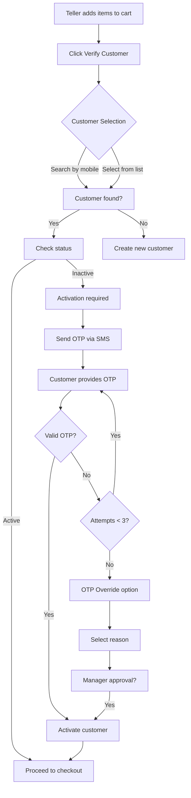

# POS Kiosk System - Strategic Plan

## Executive Summary

This document outlines the comprehensive strategic plan for implementing a Point of Sale (POS) Kiosk system for the cannabis e-commerce platform. The system will enable shop staff (tellers) to process in-store sales with customer verification, OTP activation, and complete audit trails.

## 1. Architecture & Technical Decisions

### 1.1 Authentication Extension

**Current State:**
- Existing role enum: `super_admin`, `admin`, `viewer`
- Session-based JWT authentication with role checks
- Audit logging for all authenticated actions

**Proposed Changes:**
```typescript
// Extend adminRoleEnum to include shop_user
export const adminRoleEnum = pgEnum("admin_role", [
  "super_admin",
  "admin",
  "viewer",
  "shop_user" // New role for POS kiosk users
]);
```

**Technical Approach:**
- Extend existing `adminUsers` table (no new table needed)
- Add role-specific permissions in middleware
- Create dedicated POS session tracking
- Implement device/kiosk binding for security

### 1.2 Database Schema Design

**New Tables Required:**

```sql
-- Orders table for POS and future e-commerce
orders {
  id: uuid
  orderNumber: varchar (unique, auto-generated)
  orderType: enum('pos', 'online', 'phone')

  -- Customer Reference
  subscriberId: uuid (FK to subscribers)
  customerName: varchar (denormalized)
  customerMobile: varchar (denormalized)

  -- Shop/Teller Reference
  shopUserId: uuid (FK to adminUsers)
  shopLocation: varchar
  kioskId: varchar

  -- Order Details
  items: jsonb (array of products with quantities, prices)
  subtotal: integer
  tax: integer
  discount: integer
  total: integer

  -- Payment
  paymentMethod: enum('cash', 'card', 'eft', 'voucher')
  paymentStatus: enum('pending', 'completed', 'refunded')
  paymentReference: varchar

  -- Status
  status: enum('draft', 'confirmed', 'fulfilled', 'cancelled')
  notes: text

  -- Timestamps
  createdAt, updatedAt, completedAt
}

-- OTP Override Logs for compliance
otp_override_logs {
  id: uuid
  subscriberId: uuid (FK)
  shopUserId: uuid (FK)

  -- Override Details
  overrideReason: enum (see below)
  explanation: text
  originalOtpCode: varchar (encrypted)

  -- Context
  orderId: uuid (FK to orders)
  ipAddress: varchar
  kioskId: varchar

  -- Audit
  createdAt: timestamp
}

-- Kiosk Sessions for device tracking
kiosk_sessions {
  id: uuid
  shopUserId: uuid (FK)
  kioskId: varchar

  -- Session Info
  startedAt: timestamp
  endedAt: timestamp
  isActive: boolean

  -- Device Info
  deviceFingerprint: varchar
  browserInfo: jsonb
  ipAddress: varchar

  -- Activity Metrics
  ordersProcessed: integer
  totalSales: integer
}
```

**OTP Override Reasons Enum:**
```typescript
export const otpOverrideReasonEnum = pgEnum("otp_override_reason", [
  "sms_delivery_failure",
  "network_issues",
  "customer_phone_issues",
  "international_number",
  "elderly_assistance",
  "disability_accommodation",
  "technical_error",
  "manager_approval"
]);
```

### 1.3 Integration Architecture

**Component Integration:**
```
┌─────────────────────────────────────────────────────────┐
│                    POS Kiosk Frontend                    │
│  (Next.js App Router - /pos route group)                 │
└────────────┬────────────────────────┬───────────────────┘
             │                        │
    ┌────────▼──────────┐   ┌────────▼──────────┐
    │  Product Catalog  │   │   Cart Manager    │
    │    Component      │   │    Component      │
    └────────┬──────────┘   └────────┬──────────┘
             │                        │
    ┌────────▼────────────────────────▼───────────┐
    │           POS Server Actions                 │
    │  - Customer verification                     │
    │  - OTP generation & validation               │
    │  - Order processing                          │
    │  - Inventory updates                          │
    └────────────────────┬─────────────────────────┘
                         │
         ┌───────────────▼────────────────┐
         │     PostgreSQL Database        │
         │  - Orders                      │
         │  - Inventory tracking          │
         │  - Audit logs                  │
         └────────────────────────────────┘
```

### 1.4 Security Considerations

**Access Control:**
- POS routes protected by `shop_user` role requirement
- Kiosk device fingerprinting and IP whitelisting
- Session timeout after inactivity (configurable)
- Mandatory audit logging for all transactions

**Data Security:**
- Customer data viewing restricted (PII masking)
- No access to admin functions from POS
- Encrypted OTP storage and transmission
- PCI compliance for payment data (future)

**Compliance:**
- Complete audit trail for regulatory compliance
- OTP override justification requirement
- Customer age verification tracking
- Transaction immutability

## 2. UI/UX Strategy

### 2.1 Layout Architecture

**Split-Screen Design:**
```
┌─────────────────────────────────────────────────────────────┐
│                      POS Header Bar                         │
│  [Logo] [Teller Name] [Location]          [Help] [Logout]   │
├──────────────────────────────┬──────────────────────────────┤
│                              │                              │
│     Product Catalog (60%)    │      Cart Panel (40%)        │
│                              │                              │
│  ┌─────────────────────────┐ │  Customer: [Select/Search]   │
│  │  Category Filters        │ │  ─────────────────────────   │
│  │  □ Pre-rolls  □ Edibles  │ │                              │
│  │  □ Vapes     □ Flower    │ │  Items:                      │
│  └─────────────────────────┘ │  • Product 1    x2    R500   │
│                              │  • Product 2    x1    R250   │
│  ┌─────────┬─────────┐      │                              │
│  │Product 1 │Product 2│      │  ─────────────────────────   │
│  │  R250    │  R180   │      │  Subtotal:           R750    │
│  │ [Add]    │ [Add]   │      │  Tax (15%):          R112    │
│  └─────────┴─────────┘      │  Total:              R862    │
│                              │                              │
│                              │  [Verify Customer]           │
│                              │  [Process Payment]           │
└──────────────────────────────┴──────────────────────────────┘
```

### 2.2 Component Architecture

**Core Components:**
```typescript
// Component hierarchy
/pos
  ├── layout.tsx (POS-specific theme wrapper)
  ├── page.tsx (main kiosk interface)
  ├── components/
  │   ├── POSHeader.tsx
  │   ├── ProductCatalog/
  │   │   ├── CategoryFilter.tsx
  │   │   ├── ProductGrid.tsx
  │   │   └── ProductQuickView.tsx
  │   ├── Cart/
  │   │   ├── CartPanel.tsx
  │   │   ├── CartItem.tsx
  │   │   └── CartSummary.tsx
  │   ├── Customer/
  │   │   ├── CustomerSearch.tsx
  │   │   ├── CustomerVerification.tsx
  │   │   └── OTPActivation.tsx
  │   └── Checkout/
  │       ├── PaymentSelector.tsx
  │       └── OrderConfirmation.tsx
```

### 2.3 Theme Integration

**POS Theme (extending admin.css):**
```css
.pos-theme {
  /* Inherit admin professional blue/slate palette */
  --pos-background: var(--admin-background);
  --pos-primary: var(--admin-primary);

  /* POS-specific adjustments */
  --pos-product-card: oklch(0.18 0.02 240);
  --pos-cart-bg: oklch(0.14 0.02 240);
  --pos-success: oklch(0.62 0.18 145);

  /* Larger touch targets for kiosk */
  --pos-min-touch-target: 48px;
}
```

### 2.4 Responsive Considerations

**Kiosk Display Optimization:**
- Target resolution: 1920x1080 (standard kiosk)
- Touch-optimized with 48px minimum targets
- High contrast for retail environment visibility
- Large, clear typography (min 16px base)
- Keyboard support for accessibility

## 3. Data Flow & Integration

### 3.1 Customer Verification Workflow



### 3.2 Order Processing Flow

```typescript
// Server Action pseudo-code
async function processOrder(data: {
  customerId: string,
  items: CartItem[],
  paymentMethod: string,
  tellerNotes?: string
}) {
  // 1. Validate customer status
  const customer = await validateCustomer(data.customerId);

  // 2. Check inventory
  await checkInventory(data.items);

  // 3. Calculate totals with tax
  const orderTotals = calculateOrder(data.items);

  // 4. Create order record
  const order = await createOrder({
    ...data,
    ...orderTotals,
    shopUserId: currentUser.id,
    kioskId: getKioskId()
  });

  // 5. Update inventory
  await updateInventory(data.items);

  // 6. Log audit trail
  await logAudit({
    action: 'pos_sale',
    orderId: order.id,
    amount: orderTotals.total
  });

  // 7. Return confirmation
  return { orderId: order.id, orderNumber: order.orderNumber };
}
```

### 3.3 Audit Trail Requirements

**Every POS action must log:**
- Timestamp
- Shop user ID and name
- Customer ID (if applicable)
- Action type
- Order details (if applicable)
- Kiosk ID
- IP address
- Success/failure status

## 4. Implementation Phases

### Phase 1: Foundation (Week 1)
**Owner: Gal (Database) + Adi (Backend)**

**Deliverables:**
1. Database schema migration
   - Add `shop_user` role to enum
   - Create orders table
   - Create otp_override_logs table
   - Create kiosk_sessions table

2. Authentication updates
   - Extend middleware for shop_user role
   - Create POS-specific session management
   - Implement kiosk device tracking

3. Base Server Actions
   - Customer lookup and verification
   - Basic order creation
   - Audit logging integration

### Phase 2: UI Framework (Week 1-2)
**Owner: Tal (Frontend)**

**Deliverables:**
1. POS route structure
   - /pos layout with theme
   - Authentication guard
   - Kiosk header component

2. Split-screen layout
   - Responsive grid system
   - Touch-optimized spacing
   - Theme integration

3. Component shells
   - ProductCatalog container
   - Cart panel container
   - Customer verification modal

### Phase 3: Product Catalog (Week 2)
**Owner: Tal (Frontend) + Adi (Backend)**

**Deliverables:**
1. Product display
   - Category filtering
   - Product cards with images
   - Quick add to cart
   - Real-time inventory status

2. Server Actions
   - Product fetching with filters
   - Inventory checking
   - Price calculations

### Phase 4: Cart Management (Week 2-3)
**Owner: Tal (Frontend)**

**Deliverables:**
1. Cart functionality
   - Add/remove items
   - Quantity adjustments
   - Running total calculation
   - Tax computation

2. Cart persistence
   - Session storage
   - Cart recovery on refresh

### Phase 5: Customer Management (Week 3)
**Owner: Adi (Fullstack)**

**Deliverables:**
1. Customer search
   - Mobile number lookup
   - Customer list display
   - Status indicators

2. OTP activation flow
   - SMS integration
   - OTP input interface
   - Countdown timer
   - Retry logic

3. OTP override
   - Reason selection
   - Manager approval flow
   - Override logging

### Phase 6: Checkout Process (Week 3-4)
**Owner: Adi (Backend) + Tal (Frontend)**

**Deliverables:**
1. Payment selection
   - Payment method buttons
   - Amount tendered input
   - Change calculation

2. Order processing
   - Order creation
   - Inventory updates
   - Receipt generation
   - Success confirmation

### Phase 7: Testing & QA (Week 4)
**Owner: Uri (Testing)**

**Deliverables:**
1. Unit tests
   - Component testing
   - Server action testing
   - Utility function testing

2. Integration tests
   - Full checkout flow
   - OTP verification flow
   - Error handling

3. E2E tests
   - Complete POS workflow
   - Edge cases
   - Performance testing

### Phase 8: Documentation & Training (Week 4)
**Owner: Yael (Documentation)**

**Deliverables:**
1. Technical documentation
   - API documentation
   - Component documentation
   - Database schema docs

2. User documentation
   - Teller training guide
   - Troubleshooting guide
   - Video tutorials

## 5. Success Criteria

### 5.1 Functional Requirements
- ✓ Shop user can log in and access POS only
- ✓ Products display with real-time inventory
- ✓ Cart management with running totals
- ✓ Customer verification before checkout
- ✓ OTP activation for inactive customers
- ✓ OTP override with reason logging
- ✓ Order processing with inventory updates
- ✓ Complete audit trail for compliance

### 5.2 Performance Benchmarks
- Page load: < 2 seconds
- Product search: < 500ms
- Order processing: < 3 seconds
- OTP sending: < 2 seconds
- Cart updates: instant (< 100ms)

### 5.3 Security Requirements
- Role-based access control enforced
- All actions logged for audit
- Customer PII protected
- Session timeout after 30 minutes inactive
- Device fingerprinting implemented

### 5.4 Usability Metrics
- Touch targets ≥ 48px
- Contrast ratio ≥ 4.5:1
- Font size ≥ 16px
- Error messages clear and actionable
- Success feedback immediate

## 6. Risk Mitigation

### Technical Risks
| Risk | Mitigation |
|------|-----------|
| SMS delivery failures | OTP override mechanism with logging |
| Network connectivity issues | Offline queue with sync capability |
| Inventory sync delays | Optimistic UI with rollback |
| Performance degradation | Database indexing and caching |

### Business Risks
| Risk | Mitigation |
|------|-----------|
| Unauthorized access | Multi-factor authentication for shop users |
| Compliance violations | Comprehensive audit logging |
| Training challenges | Intuitive UI and documentation |
| Data loss | Regular backups and transaction logs |

## 7. Future Enhancements

### Phase 2 Features (Post-MVP)
1. **Offline Mode**
   - Local storage queue
   - Automatic sync when online
   - Conflict resolution

2. **Advanced Analytics**
   - Real-time sales dashboard
   - Teller performance metrics
   - Popular product tracking

3. **Loyalty Integration**
   - Points earning
   - Reward redemption
   - Member pricing

4. **Multi-location Support**
   - Location-specific inventory
   - Inter-store transfers
   - Centralized reporting

5. **Hardware Integration**
   - Barcode scanner support
   - Receipt printer integration
   - Cash drawer control
   - Card reader integration

## 8. Implementation Timeline

```
Week 1: Foundation & Setup
  Mon-Tue: Database schema (Gal)
  Wed-Thu: Auth updates (Adi)
  Fri: UI framework start (Tal)

Week 2: Core Features
  Mon-Tue: Product catalog (Tal/Adi)
  Wed-Thu: Cart management (Tal)
  Fri: Customer search (Adi)

Week 3: Advanced Features
  Mon-Tue: OTP flows (Adi)
  Wed-Thu: Checkout process (Adi/Tal)
  Fri: Integration testing (Uri)

Week 4: Polish & Deploy
  Mon-Tue: Final testing (Uri)
  Wed: Documentation (Yael)
  Thu: Training materials (Yael)
  Fri: Deployment prep
```

## 9. Agent Assignments Summary

### Primary Responsibilities

**Gal (Database Architect):**
- Database schema design and migrations
- Query optimization
- Data integrity constraints

**Adi (Fullstack Developer):**
- Server Actions implementation
- Customer verification logic
- OTP integration
- Order processing
- API endpoints

**Tal (Frontend Developer):**
- POS UI components
- Layout implementation
- Cart management UI
- Theme integration
- Touch optimization

**Uri (QA Engineer):**
- Test suite development
- Integration testing
- Performance testing
- Bug tracking

**Yael (Technical Writer):**
- API documentation
- User guides
- Training materials
- Troubleshooting docs

**Noam (Prompt Engineer):**
- Error message optimization
- User feedback messages
- Help text refinement

## 10. Conclusion

This strategic plan provides a comprehensive roadmap for implementing the POS Kiosk system. The phased approach ensures systematic development with clear ownership and measurable outcomes. The architecture leverages existing systems while adding POS-specific functionality, maintaining security and compliance throughout.

The split-screen kiosk interface optimized for touch interaction, combined with robust customer verification and audit trails, will provide an efficient and compliant point-of-sale solution for the cannabis retail environment.

---

**Document Status:** Ready for Review
**Last Updated:** Current
**Next Steps:**
1. Review and approve plan
2. Update CLAUDE.md with shop user credentials
3. Begin Phase 1 implementation