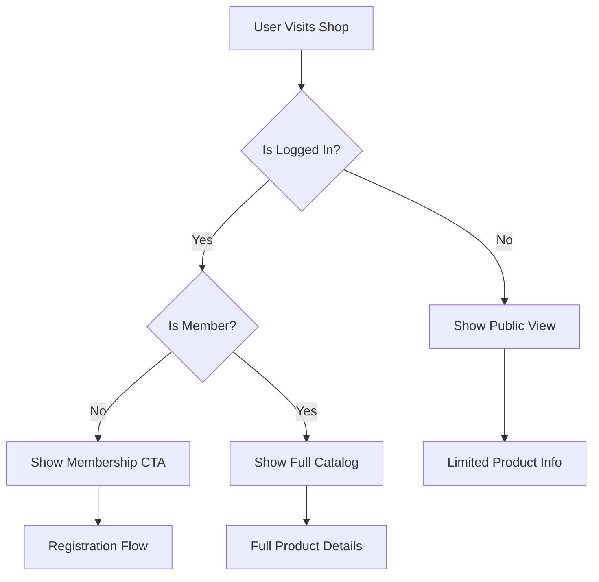

# Shop/Specials Feature - Strategic Planning & Architecture

## Executive Summary

This document outlines the strategic planning and technical architecture for implementing a shop/specials page feature for the Bigg Buzz cannabis collective platform. The feature will showcase product categories with pricing, enforce membership requirements, and provide admin management capabilities.

## 1. Business Requirements Analysis

### Core Objectives
- Display categorized cannabis products with transparent pricing
- Enforce membership/hive requirements for product access
- Enable dynamic price management through admin interface
- Create scalable product management system
- Maintain compliance with South African cannabis regulations

### User Personas
1. **Public Visitors**: Browse products, view prices, understand membership benefits
2. **Hive Members**: Access full product catalog, place orders
3. **Admin Users**: Manage products, update pricing, track inventory

### Success Metrics
- Conversion rate from visitor to member registration
- Product catalog maintenance efficiency
- Price update turnaround time
- System scalability for product expansion

## 2. Technical Architecture

### 2.1 Data Architecture

#### Database Schema Design

```typescript
// Products Table
export const products = pgTable("products", {
  id: uuid("id").primaryKey().defaultRandom(),

  // Product Information
  name: varchar("name", { length: 255 }).notNull(),
  slug: varchar("slug", { length: 255 }).notNull().unique(),
  description: text("description"),
  shortDescription: varchar("short_description", { length: 500 }),

  // Category & Classification
  categoryId: uuid("category_id").notNull().references(() => productCategories.id),
  sku: varchar("sku", { length: 100 }).unique(),
  productType: productTypeEnum("product_type").notNull(), // pre_roll, dab, edible, vape

  // Pricing
  price: integer("price").notNull(), // Store in cents (R250.00 = 25000)
  comparePrice: integer("compare_price"), // Original price for discounts
  costPrice: integer("cost_price"), // Internal cost tracking

  // Inventory
  quantity: integer("quantity").notNull().default(0),
  trackQuantity: boolean("track_quantity").notNull().default(true),
  allowBackorder: boolean("allow_backorder").notNull().default(false),
  lowStockThreshold: integer("low_stock_threshold").default(5),

  // Status & Visibility
  status: productStatusEnum("status").notNull().default("draft"), // draft, active, archived
  isVisible: boolean("is_visible").notNull().default(true),
  isFeatured: boolean("is_featured").notNull().default(false),

  // Attributes
  weight: varchar("weight", { length: 50 }), // e.g., "1g", "2g"
  potency: varchar("potency", { length: 50 }), // e.g., "THC 20%"
  strain: varchar("strain", { length: 100 }), // e.g., "Sativa", "Indica", "Hybrid"

  // Media
  imageUrl: text("image_url"),
  images: jsonb("images").$type<string[]>().default([]),

  // SEO
  metaTitle: varchar("meta_title", { length: 255 }),
  metaDescription: text("meta_description"),

  // Membership Requirements
  requiresMembership: boolean("requires_membership").notNull().default(true),
  membershipTier: varchar("membership_tier", { length: 50 }), // basic, premium, vip

  // Analytics
  viewCount: integer("view_count").notNull().default(0),
  purchaseCount: integer("purchase_count").notNull().default(0),

  // Metadata
  tags: jsonb("tags").$type<string[]>().default([]),
  customFields: jsonb("custom_fields").$type<Record<string, any>>(),

  // Timestamps
  createdAt: timestamp("created_at").defaultNow().notNull(),
  updatedAt: timestamp("updated_at").defaultNow().notNull(),
  publishedAt: timestamp("published_at"),
  createdBy: uuid("created_by").references(() => adminUsers.id),
  updatedBy: uuid("updated_by").references(() => adminUsers.id)
});

// Product Categories Table
export const productCategories = pgTable("product_categories", {
  id: uuid("id").primaryKey().defaultRandom(),

  name: varchar("name", { length: 100 }).notNull(),
  slug: varchar("slug", { length: 100 }).notNull().unique(),
  description: text("description"),

  parentId: uuid("parent_id"), // For subcategories
  sortOrder: integer("sort_order").notNull().default(0),

  imageUrl: text("image_url"),
  iconName: varchar("icon_name", { length: 50 }), // Lucide icon name

  isActive: boolean("is_active").notNull().default(true),

  metaTitle: varchar("meta_title", { length: 255 }),
  metaDescription: text("meta_description"),

  createdAt: timestamp("created_at").defaultNow().notNull(),
  updatedAt: timestamp("updated_at").defaultNow().notNull()
});

// Price History Table (for tracking changes)
export const priceHistory = pgTable("price_history", {
  id: uuid("id").primaryKey().defaultRandom(),

  productId: uuid("product_id").notNull().references(() => products.id, { onDelete: "cascade" }),

  oldPrice: integer("old_price").notNull(),
  newPrice: integer("new_price").notNull(),

  reason: text("reason"),
  changedBy: uuid("changed_by").notNull().references(() => adminUsers.id),

  createdAt: timestamp("created_at").defaultNow().notNull()
});
```

#### Enums
```typescript
export const productTypeEnum = pgEnum("product_type", [
  "pre_roll",
  "dab",
  "edible",
  "vape",
  "flower",
  "concentrate",
  "accessory"
]);

export const productStatusEnum = pgEnum("product_status", [
  "draft",
  "active",
  "archived",
  "out_of_stock"
]);
```

### 2.2 API Architecture

#### Server Actions (Recommended Approach)
```typescript
// src/app/actions/products.ts
export async function getProducts(params: {
  category?: string;
  search?: string;
  sort?: string;
  page?: number;
  limit?: number;
}) {
  // Implementation
}

export async function getProductBySlug(slug: string) {
  // Implementation
}

// Admin actions
export async function updateProductPrice(
  productId: string,
  newPrice: number,
  reason?: string
) {
  // Implementation with audit logging
}
```

#### REST API Routes (Alternative)
```
GET    /api/products           - List all products
GET    /api/products/[slug]    - Get single product
GET    /api/categories         - List categories

// Admin endpoints
PUT    /api/admin/products/[id]         - Update product
PUT    /api/admin/products/[id]/price   - Update price
POST   /api/admin/products              - Create product
DELETE /api/admin/products/[id]         - Archive product
```

## 3. Component Architecture

### 3.1 Folder Structure
```
src/
├── app/
│   ├── specials/
│   │   ├── page.tsx                    # Main shop page
│   │   ├── layout.tsx                  # Shop layout wrapper
│   │   ├── [category]/
│   │   │   └── page.tsx                # Category filter page
│   │   └── product/[slug]/
│   │       └── page.tsx                # Product detail page
│   │
│   ├── admin/
│   │   └── products/
│   │       ├── page.tsx                # Product management
│   │       ├── new/page.tsx            # Create product
│   │       └── [id]/edit/page.tsx     # Edit product
│   │
│   ├── actions/
│   │   ├── products.ts                 # Product server actions
│   │   └── categories.ts               # Category server actions
│   │
│   └── api/
│       └── admin/
│           └── products/
│               ├── route.ts             # CRUD operations
│               └── [id]/
│                   └── price/route.ts   # Price updates
│
├── components/
│   ├── shop/
│   │   ├── ProductCard.tsx             # Individual product display
│   │   ├── ProductGrid.tsx             # Product grid layout
│   │   ├── CategoryFilter.tsx          # Category navigation
│   │   ├── PriceDisplay.tsx            # Price formatting
│   │   ├── MembershipBanner.tsx        # Hive membership CTA
│   │   ├── ProductSearch.tsx           # Search functionality
│   │   └── ProductSkeleton.tsx         # Loading states
│   │
│   └── admin/
│       └── products/
│           ├── ProductTable.tsx        # Admin product list
│           ├── ProductForm.tsx         # Create/edit form
│           ├── PriceUpdateModal.tsx    # Quick price update
│           └── BulkActions.tsx         # Bulk operations
│
├── lib/
│   ├── db/
│   │   └── schema/
│   │       └── products.ts             # Product schemas
│   │
│   ├── validations/
│   │   └── products.ts                 # Zod schemas
│   │
│   └── utils/
│       ├── products.ts                 # Product utilities
│       └── pricing.ts                  # Price formatting
│
└── types/
    └── products.ts                     # TypeScript types
```

### 3.2 Component Strategy

#### Core Components Using shadcn/ui

1. **ProductCard Component**
```typescript
// Uses: Card, Badge, Button from shadcn/ui
interface ProductCardProps {
  product: Product;
  showPrice?: boolean;
  isMember?: boolean;
}
```

2. **CategoryFilter Component**
```typescript
// Uses: Tabs, Select, Button from shadcn/ui
interface CategoryFilterProps {
  categories: Category[];
  activeCategory?: string;
  onCategoryChange: (category: string) => void;
}
```

3. **MembershipBanner Component**
```typescript
// Uses: Alert, Button, Dialog from shadcn/ui
interface MembershipBannerProps {
  variant?: 'inline' | 'modal' | 'banner';
  onJoinClick: () => void;
}
```

## 4. State Management Strategy

### 4.1 Data Fetching Pattern
- **Server Components**: Default for initial page loads
- **Server Actions**: For mutations and real-time updates
- **React Query/SWR**: For client-side caching (if needed)
- **Optimistic Updates**: For price changes in admin

### 4.2 Cache Strategy
```typescript
// Using Next.js caching
export const revalidate = 60; // Revalidate every minute

// Manual revalidation on updates
import { revalidatePath } from 'next/cache';
revalidatePath('/specials');
```

## 5. Admin Integration Plan

### 5.1 Navigation Update
Add to AdminSidebar navigation array:
```typescript
{
  title: "Products",
  href: "/admin/products",
  icon: Package,
  badge: lowStockCount > 0 ? lowStockCount : undefined,
  badgeVariant: "destructive"
}
```

### 5.2 Admin Features
1. **Product Management Dashboard**
   - Quick stats (total products, low stock, price changes)
   - Bulk price updates
   - Category management
   - Stock tracking

2. **Price Management UI**
   - Inline editing with validation
   - Price history tracking
   - Bulk discount application
   - Audit trail integration

3. **Permissions**
   - `view_products`: View product list
   - `manage_products`: Create/edit products
   - `update_prices`: Modify pricing
   - `manage_inventory`: Stock control

## 6. Membership Integration

### 6.1 Access Control Flow


### 6.2 UI Patterns
- **Non-members**: Blurred prices with "Join to see pricing"
- **Public view**: Product names and categories visible
- **Member view**: Full details, pricing, and purchase options
- **CTAs**: Strategic placement of membership benefits

## 7. Implementation Roadmap

### Phase 1: Foundation (Week 1)
- [ ] Database schema implementation
- [ ] Basic product CRUD operations
- [ ] Admin product management page
- [ ] Initial data seeding

### Phase 2: Public Interface (Week 1-2)
- [ ] Shop page with product grid
- [ ] Category filtering
- [ ] Product detail pages
- [ ] Membership banner integration

### Phase 3: Admin Features (Week 2)
- [ ] Price management interface
- [ ] Bulk operations
- [ ] Audit logging for price changes
- [ ] Real-time updates via WebSocket

### Phase 4: Enhancement (Week 3)
- [ ] Search functionality
- [ ] Advanced filtering
- [ ] Analytics integration
- [ ] Performance optimization

### Phase 5: Testing & Launch (Week 3-4)
- [ ] Unit tests for core functions
- [ ] Integration tests for APIs
- [ ] E2E tests for user flows
- [ ] Performance testing
- [ ] Security audit

## 8. Performance Considerations

### 8.1 Optimization Strategies
- **Image Optimization**: Next.js Image component with CDN
- **Lazy Loading**: Virtualized lists for large catalogs
- **Caching**: Redis for frequently accessed data
- **Database**: Indexes on slug, category, status fields
- **Static Generation**: Pre-render category pages

### 8.2 Scalability Planning
- **CDN**: CloudFlare for static assets
- **Database**: Read replicas for high traffic
- **Search**: ElasticSearch for advanced search (future)
- **Microservices**: Separate inventory service (future)

## 9. Security Considerations

### 9.1 Access Control
- Row-level security for product visibility
- Admin action audit trail
- Rate limiting on price updates
- Input validation at all levels

### 9.2 Compliance
- Age verification enforcement
- Terms acceptance tracking
- Price change audit trail
- POPIA compliance for user data

## 10. Technology Decisions

### 10.1 Recommended Stack
- **Database**: PostgreSQL with Drizzle ORM (existing)
- **Validation**: Zod for type-safe validation
- **UI Components**: shadcn/ui (existing)
- **State**: Server Components + Server Actions
- **Search**: PostgreSQL full-text search (initially)
- **Caching**: Next.js built-in + Redis (existing)

### 10.2 Alternative Approaches

#### Option A: Headless CMS
- **Pros**: Quick setup, built-in features
- **Cons**: External dependency, less control
- **Verdict**: Not recommended given existing architecture

#### Option B: Microservice Architecture
- **Pros**: Scalable, isolated concerns
- **Cons**: Complexity, overhead for current scale
- **Verdict**: Consider for future expansion

#### Option C: Static JSON Files
- **Pros**: Simple, fast, version controlled
- **Cons**: No dynamic updates, limited scalability
- **Verdict**: Only for MVP/prototype

## 11. Risk Analysis & Mitigation

### Technical Risks
1. **Performance degradation with catalog growth**
   - Mitigation: Implement pagination, caching, CDN

2. **Price synchronization issues**
   - Mitigation: Audit logs, webhooks, real-time updates

3. **Inventory tracking accuracy**
   - Mitigation: Transactional updates, regular audits

### Business Risks
1. **Regulatory compliance**
   - Mitigation: Legal review, age verification, terms acceptance

2. **Price competitiveness**
   - Mitigation: Easy price updates, competitor monitoring

## 12. Success Metrics & KPIs

### Technical Metrics
- Page load time < 2s
- API response time < 200ms
- 99.9% uptime
- Zero critical security issues

### Business Metrics
- Member conversion rate > 15%
- Product view to inquiry rate > 5%
- Admin efficiency (price updates < 30s)
- Catalog maintenance time reduced by 50%

## 13. Next Steps

### Immediate Actions
1. Review and approve this strategic plan
2. Set up database migrations
3. Create initial product seed data
4. Begin Phase 1 implementation

### Team Coordination
- **Tal (Frontend)**: Shop UI components
- **Adi (Fullstack)**: API and database implementation
- **Uri (Testing)**: Test strategy and implementation
- **Noam (Prompts)**: User interaction optimization

## Appendix A: Initial Product Data

```typescript
const initialProducts = [
  // Pre-rolls
  { name: "Greendoor x2", category: "pre_roll", price: 25000, weight: "2 joints" },
  { name: "Indoor x1", category: "pre_roll", price: 30000, weight: "1 joint" },
  { name: "Indoor x2", category: "pre_roll", price: 50000, weight: "2 joints" },
  { name: "Indoor x3", category: "pre_roll", price: 70000, weight: "3 joints" },
  { name: "Indoor x4", category: "pre_roll", price: 90000, weight: "4 joints" },
  { name: "Indoor x5", category: "pre_roll", price: 100000, weight: "5 joints" },
  { name: "Indoor x10", category: "pre_roll", price: 150000, weight: "10 joints" },

  // Dabs
  { name: "Buddah Hit", category: "dab", price: 30000, potency: "High THC" },
  { name: "Diamondz Hit", category: "dab", price: 45000, potency: "Premium THC" },

  // Edibles
  { name: "40MG Edible", category: "edible", price: 8000, potency: "40mg THC" },
  { name: "80MG Edible", category: "edible", price: 16000, potency: "80mg THC" },

  // THC Vapes
  { name: "10th Planet", category: "vape", price: 80000, strain: "Hybrid" },
  { name: "Cannabis Collective", category: "vape", price: 120000, strain: "Premium" }
];
```

## Appendix B: Admin Dashboard Mockup

```
┌─────────────────────────────────────────┐
│ Products Management                     │
├─────────────────────────────────────────┤
│ Quick Stats                             │
│ ┌──────────┬──────────┬──────────┐     │
│ │ Total    │ Low Stock│ Revenue  │     │
│ │ 14       │ 2        │ R45,250  │     │
│ └──────────┴──────────┴──────────┘     │
│                                         │
│ Product List                            │
│ ┌─────────────────────────────────────┐ │
│ │ Name          Category  Price   ▼│ │ │
│ ├─────────────────────────────────────┤ │
│ │ Indoor x2     Pre-roll  R500   ✏️│ │ │
│ │ Buddah Hit    Dabs      R300   ✏️│ │ │
│ │ 10th Planet   Vapes     R800   ✏️│ │ │
│ └─────────────────────────────────────┘ │
│                                         │
│ [+ Add Product] [Bulk Update] [Export] │
└─────────────────────────────────────────┘
```

---

*This strategic plan provides a comprehensive roadmap for implementing the shop/specials feature. The modular approach allows for iterative development while maintaining scalability and performance.*